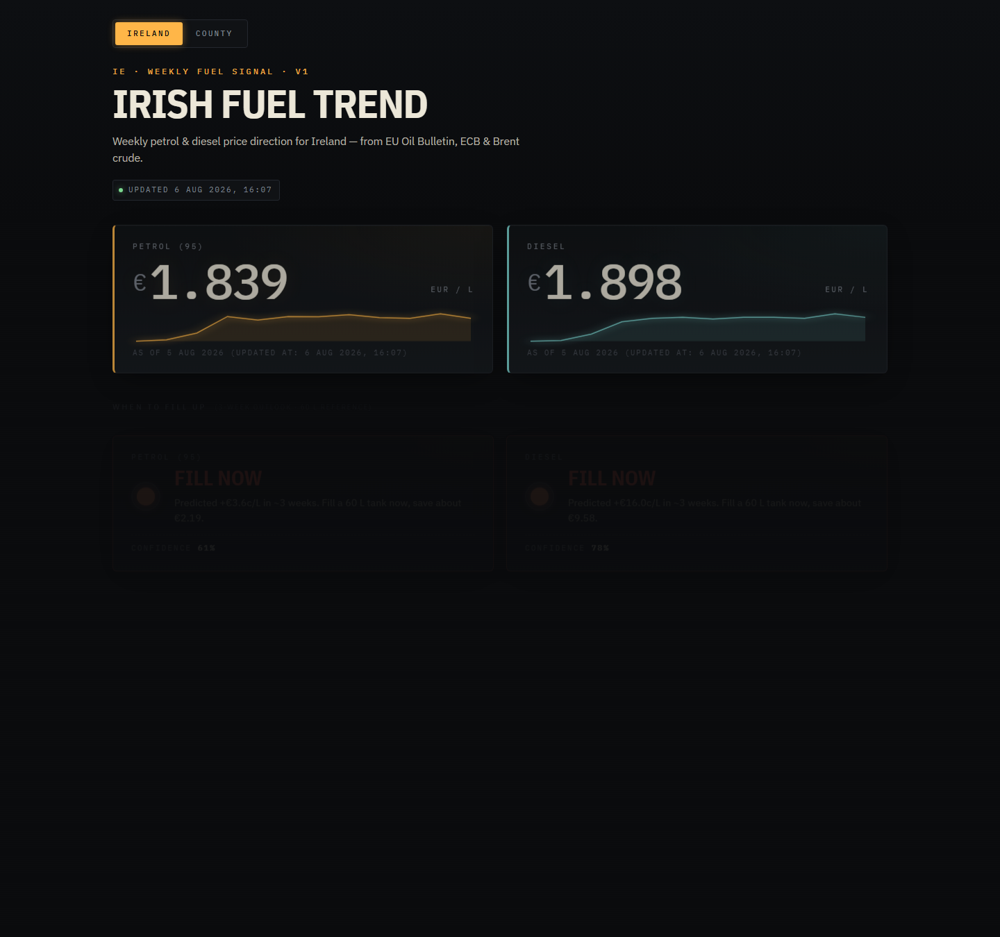
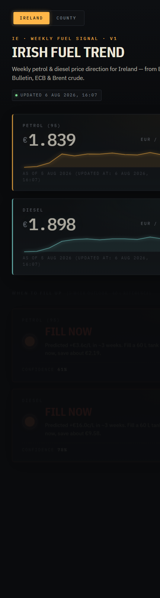

# Irish Fuel Trend

**Know when to fill up. Save at every pump.**

Irish Fuel Trend tells you — in one glance — whether petrol and diesel are
heading up or down this week, how much a full tank will cost you if you wait,
and which forecourt in your county is cheapest right now.

Free. No login. Refreshed every morning.

👉 **[Open the app](https://raghibhaque.github.io/petrolpredictor/)**

---

## What it looks like



<p align="center">
  
</p>

---

## Why people use it

- **Fill now or wait?** — Every morning you get a plain-English call for petrol
  and diesel. *"Fill now — save about €2.19 on a 60 L tank"* — not a chart you
  have to interpret.
- **Priced for your county** — 26 counties, each with its own crowd-sourced
  median and a short-list of the cheapest reported stations near you.
- **The number you actually pay** — Anchored to the freshest live pump report,
  not last month's government survey.
- **Confidence, not certainty** — Every forecast shows how sure the model is.
  If the market turns choppy, you'll see the confidence drop.
- **Zero friction** — Loads in under a second on a phone. No account. No app
  store. No cookies chasing you around the web.

---

## Who it's for

- **Commuters** deciding whether Monday's tank can wait until Friday.
- **Delivery drivers, taxi drivers, hauliers** — anyone whose margin is a few
  cents a litre.
- **Households on a budget** who'd rather save €50 a year than not.
- **Fuel-price nerds** who want to see the wholesale-vs-retail spread the same
  way traders do.

---

## How it works (the short version)

We watch the two things that actually move Irish pump prices:

1. **Brent crude** — the world price of oil, in dollars a barrel.
2. **The euro-to-dollar rate** — because we buy oil in dollars but pay for
   petrol in euros.

Every morning, we combine those with the last few weeks of Irish pump prices
(from the EU's official weekly bulletin and daily crowd-sourced reports on
FuelWatch.ie) and a small statistical model tells you the most likely direction
for the next three weeks — with a confidence score attached.

Then we shift that national forecast to your county using the current local
gap between crowd-reported prices and the national average, so a driver in
Donegal sees a different number to one in Cork.

---

## What it costs

**Nothing.** No ads, no email capture, no upsell. This started as a personal
project to answer *"is now a good time to fill up?"* and stayed that way.

---

## Frequently asked

**How accurate is the forecast?**
The model gets the *direction* right about 3 weeks out of 4 across the last
year of data. Cent-perfect prices are impossible — geopolitics and refinery
outages happen — but the up/down call is usually good enough to decide whether
to fill today or wait a week.

**Why does my county sometimes say "no reports"?**
FuelWatch is crowd-sourced. Some rural counties get very few reports, and
we'd rather show you nothing than a number based on two stations. When enough
drivers submit prices for your county, it appears in the dropdown.

**Where does the price data come from?**
The European Commission's Weekly Oil Bulletin (the official government-grade
average), FuelWatch.ie (crowd-sourced daily pump reports), the European
Central Bank (EUR/USD), and Yahoo Finance (Brent crude). All public sources,
all credited.

**Is it available outside Ireland?**
Not yet. The whole project is tuned to the Irish market — Irish tax rules,
Irish counties, Irish sources. A UK version is possible if there's demand.

**Can I trust a "free" tool with my data?**
There's nothing to trust with — we don't ask for any data. No account, no
email, no location tracking. Your county choice is saved in your own browser
and never leaves it.

---

## Roadmap

- **Confidence bands** on the forecast, not just a single line.
- **Alerts** — email or push when your county's forecast flips.
- **Per-brand cheapest** — filter the cheapest-station list to the brand near
  your home or route.
- **UK expansion** if there's interest.

---

## Under the hood

<details>
<summary>For developers — click to expand</summary>

Small stack, boring on purpose:

| Layer         | Choice                                              |
| ------------- | --------------------------------------------------- |
| Backend       | FastAPI, pandas, scikit-learn                       |
| Storage       | SQLite (single file)                                |
| Scheduling    | APScheduler + GitHub Actions cron                   |
| Front-end     | Plain HTML/CSS + vanilla JS, Chart.js from CDN      |
| Deploy        | GitHub Pages (static) + optional local FastAPI      |

Same codebase runs two ways: locally as a live FastAPI app, or statically on
GitHub Pages where a nightly workflow re-ingests every source and redeploys.

Local setup:

```powershell
cd backend
python -m venv .venv
.\.venv\Scripts\Activate.ps1
pip install -r requirements.txt
python ingest.py all
python export_static.py
uvicorn app.main:app --reload --port 8000
```

Open <http://localhost:8000/>. API docs live at `/docs`.

Data sources, model, county-basis maths, deployment pipeline and full API
schema are documented in [`docs/`](docs/) and inline in
[`backend/app/`](backend/app/).

</details>

---

## Credits

Built by Raghib Haque. Prices from the EU Weekly Oil Bulletin, FuelWatch.ie,
ECB and Yahoo Finance. Not affiliated with any retailer or regulator.
